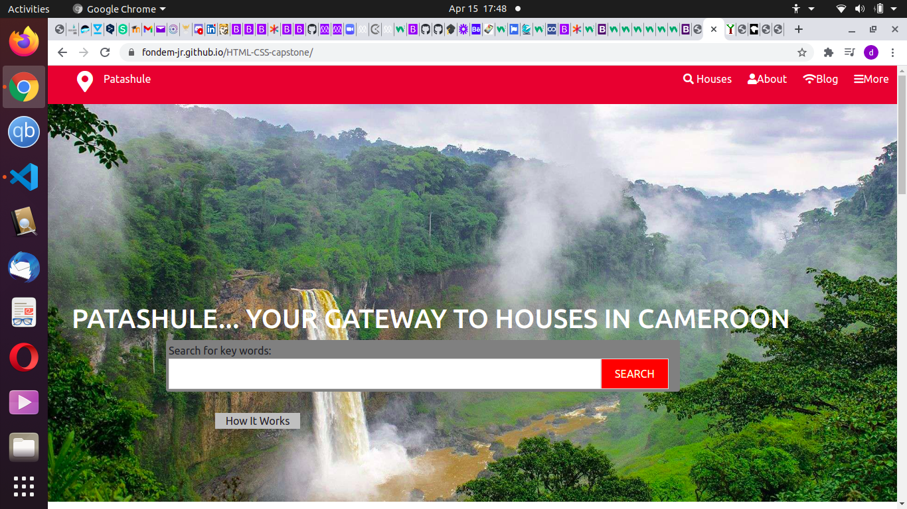
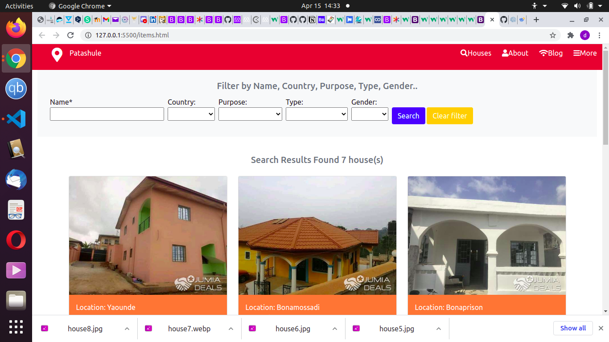

# HTML-CSS-capstone

> A website made up of three webpages, the index, list of items and detail page. This project helps us practise our skills on float, flex, grid, bootstrap.  

Additional description about the project and its features.

## Built With

- HTML
- CSS
-Bootstrap

## Live Demo

[Live Demo Link](https://fondem-jr.github.io/HTML-CSS-capstone/)

## Getting Started

**This is an example of how you may give instructions on setting up your project locally.**
**Modify this file to match your project, remove sections that don't apply. For example: delete the testing section if the currect project doesn't require testing.**

## Authors

👤 **Fondem Junior**

- GitHub: [@githubhandle](https://github.com/Fondem-Jr/)
- Twitter: [@twitterhandle](https://twitter.com/OpportunistZeus)
- LinkedIn: [LinkedIn](https://www.linkedin.com/in/fondem-junior-57484744)

## 🤝 Contributing

Contributions, issues, and feature requests are welcome!

Feel free to check the [issues page](issues/).

## Show your support

Give a ⭐️ if you like this project!

## Acknowledgments

## 📝 License

This project is [MIT](lic.url) licensed.
